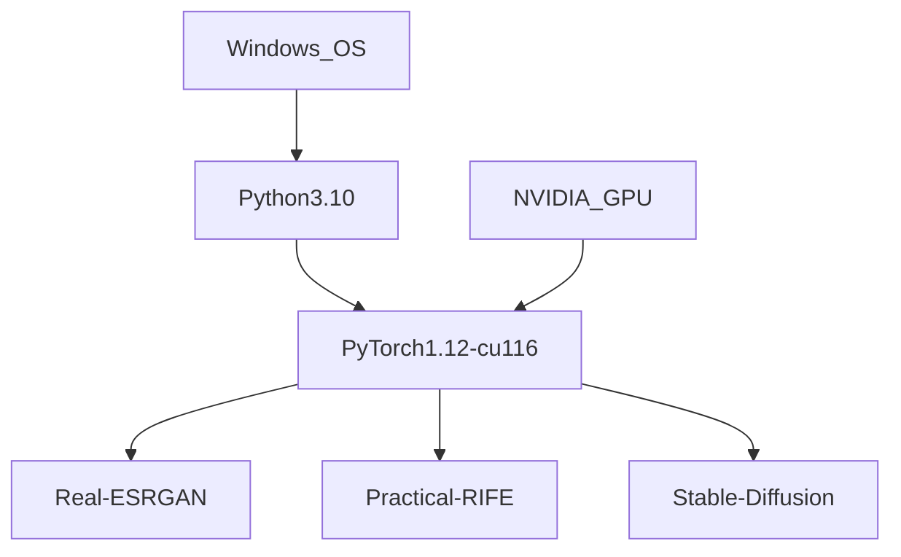

<h1 align="center">Purity_UwU</h1>

Run popular Open-Source AI tools on native Windows 10/11 (NVIDIA GPU only)

🌟 **Easy to Use**
 - Designed for the normal Windows User, not developers
 - [**Discord Support Group**](https://discord.gg/PqV9VWzer9)

🌟 **Free**
 - Your wallets are safe :money_mouth_face:	
 
🌟 **Native Performance**
 - No CPU or GPU performance loss, run natively on Windows 10/11

🌟 **Privacy & Safety**
 - Run entirely local so your data is completely safe
 - Is Open-source (GNU General Public License v3.0), you can freely inspect for malicious code

# Overview
Component | Info | Usage | GPU VRAM Usage
------------- | ------------- | ------------- | ------------
[**Stable-Diffusion**](https://github.com/CompVis/stable-diffusion) | Latent Text-to-Image Diffusion | Generate unique photo, styled arts from text prompts | **High** 16GB for 512x512 Output Image
[**Real-ESRGAN**](https://github.com/xinntao/Real-ESRGAN) [**GFPGAN**](https://github.com/TencentARC/GFPGAN) | General Image/Video Restoration Real-world Face Restoration | Enhance low-quality image or video Enhance, restore face details | **High** 28GB for 2048x2048 Input Image
[**Practical-RIFE**](https://github.com/hzwer/Practical-RIFE) | Video Frame Interpolation | Increase video framerate, create slow-motion video | **Low** 6GB for 2048x2048 Video Input

### Stable-Diffusion
Please refer to this article on how to use Stable-Diffusion, there are several options you need to understand : https://www.howtogeek.com/833169/how-to-write-an-awesome-stable-diffusion-prompt
Model | Sample
------------- | -------------
[**Default**] Example Prompts: A high tech solarpunk utopia in the Amazon rainforest A pikachu fine dining with a view to the Eiffel Tower A mecha robot in a favela in expressionist style an insect robot preparing a delicious meal |   
[**Arcane Style**](https://huggingface.co/nitrosocke/Arcane-Diffusion)  Fine-tuned Stable Diffusion model trained on images from the TV Show Arcane  Use the tokens **arcane style** in your prompts for the effect |  
[**Spider-Verse Style**](https://huggingface.co/nitrosocke/spider-verse-diffusion)  Fine-tuned Stable Diffusion model trained on movie stills from Sony's Into the Spider-Verse  Use the tokens **spiderverse style** in your prompts for the effect. | 
[**Elden Ring Style**](https://huggingface.co/nitrosocke/elden-ring-diffusion)  Fine-tuned Stable Diffusion model trained on the game art from Elden Ring  Use the tokens **elden ring style** in your prompts for the effect | 
[**Archer Style**](https://huggingface.co/nitrosocke/archer-diffusion)  Fine-tuned Stable Diffusion model trained on screenshots from the TV-show Archer  Use the tokens **archer style** in your prompts for the effect | 
### Real-ESRGAN + GFPGAN
Model | Sample
------------- | -------------
RealESRGAN_x4plus RealESRGAN_x4plus_anime_6B RealESRGAN_x2plus realesr-animevideov3 realesr-general-x4v3 |  
### Practical-RIFE
Model | Sample 
------------- | :---:
[**v4.6 - 2022.9.26**](https://github.com/hzwer/Practical-RIFE) |  [**Click to view the full sample video**](https://www.youtube.com/watch?v=6eTVTTfK6J8)

# Get Started
### System Requirements
Item | Minimum | Recommended
------------- | ------------- | -------------
CPU | Dual Core 2.0GHz | Quad Core 3.0GHz
Memory | >=8GB RAM | >=32GB RAM
NVIDIA GPU (Mandatory) | Driver Version >=452.39 (CUDA 11.x) | Driver Version >=452.39 (CUDA 11.x)
Disk Space | ~20GB for Working Directory | ~20GB for Working Directory
Operating System  | Windows 10 64-bit | Windows 11 64-bit
### Structure View

### Installation
Step | Description | Illustration
------------- | ------------- | -------------
1 | Install [**Python3.10 from Microsoft Store**](https://apps.microsoft.com/store/detail/python-310/9PJPW5LDXLZ5) | ____________________________________________________	
2 | Create a new empty folder as your Working Directory (C:/work, D:/mywork ...) | self-explanatory
3 | Download [**installer.ps1**](https://github.com/brokeDude2901/Purity_UwU/releases/download/v1.0/installer.ps1) and put it into your Working Directory | self-explanatory
4 | Enable local Powershell Script Execution: *Change execution policy to allow local PowerShell scripts to run without signing. Require signing for remote scripts*|  
4 | Right-click **installer.ps1** script and choose **Run with Powershell** | self-explanatory

### Usage
Step | Description | Illustration
------------- | ------------- | -------------
1 | 1. Right click on any file, or folder as input 2. Pick the tool you want to run | 
2 | 1. Input desired values 2. Wait for Windows Explorer to open Results Location  | ____________________________________________________

# FAQ
### Low VRAM Solution
It is possible to run on GPU with low VRAM (4GB~6GB), preventing **CUDA out of memory*** error. However, you must scarify quality and speed.
Component | Solution
------------- | -------------
Real-ESRGAN | 1. Use a smaller resolution input image: resize, downscale the image to lower resolution  2. Try a smaller model size: ie, use ***RealESRGAN_x2plus*** model instead of ***RealESRGAN_x4plus***   3. Use tile_size value different than 0. It will splits the image into multiple tiles, causing Face Restoration artifacts if the face parts was between the split, and take more times to execute. There is a tile padding options to reduce this behavior in the code, but somehow it doesn't work properly yet
Stable-Diffusion | 1. Use a smaller output image value: H (256), W (256). Then use Real-ESRGAN to upscale that result.  2. Wait for the next update, there will be FP16 mode (Half-Precision)  instead of current FP32 mode (Single-Precision), saving VRAM

### Low GPU Ultilization Problems
 - **Reason:** These tools were originally built and optimized for a high VRAM but low CUDA Cores GPU (Google Colab [***Tesla T4 16GB***](https://www.techpowerup.com/gpu-specs/tesla-t4.c3316) Turing ~ 2560 CUDA Cores)
 - **Solution:** If you still have VRAM left, just run another instance of the tool to ultilize the rest of the GPU CUDA Cores

### Run without GPU ?
 - Yes, you can run without GPU but it is really slow, and some codes will have to be rewritten because CPU doesnt support FP16
### Intel and AMD GPU Support ?
 - **AMD**: No, currently ***PyTorch ROCm*** is only available for Linux, use ***WSL2*** if you have an ***AMD GPU***
 - **Intel**: No, [***Intel PyTorch Extension***](https://pytorch.org/tutorials/recipes/recipes/intel_extension_for_pytorch.html) is only for Intel AVX-512 CPU
# Support Development (Optional)
 - If you find this tool useful, please share with your friends :smiley:
 - If you find this tool is saving you a lot of time and headaches, feel free to donate to support development, adding more components, features and optimization :smiling_face_with_three_hearts: [**Patreon**](https://patreon.com/Purity_UwU)
